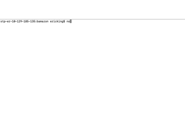
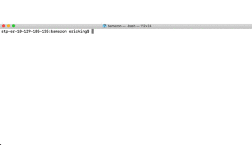
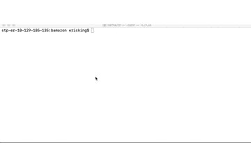

# Bamazon Application

## Overview
The Bamazon application is a node application that mimicks an online shopping program. This application utilizes a mySQL database that stores and updates data on the products for sale and the different departements that those products fall under.  The application has three different programs: bamazon - for making purchases, bamazonManager - for viewing and updating products and invetory, and bamazonSupervisor for viewing sales by department and adding new departments.

### Bamazon
When the user enters "node bamazon.js" into the terminal, all of the products that are currently for sale are displayed. The user is then prompted to enter the id of the product that they want to purchase. After they have selected a product they are prompted to enter the quantity that they would like to buy. The total price of the purchase is then displayed on the screen and the quantity purchased is subtracted from the total quantity in stock for that product.
1. 

### BamazonManager
When the user enters "node bamazonManager.js" into the terminal, they are prompted to either view all products for sale, view products with low inventory, add to the inventory of a product, or add a new product.
1. **View products for sale** When the user selects this action all of the products that are for sale are displayed along with department name, quantity in stock, and price.
2. **View low inventory** When the user selects this action all of the products with less than or equal to 5 in inventory are displayed.
3. **Add to inventory** This action allows the user to add to the current inventory of a specific product. The user will be prompted to enter the ID of the product that they would like to add inventory to, and the number of units they would like to add.
4. **Add new product** This action allows the user to enter a new product to the products table. The user will then be prompted to enter all of the necessary information about the product.
5. 

### BamazonSupervisor
When the user enters "node bamazonSupervisor.js" into the terminal, they are prompted to either view sales by department, or add a new department or exit the program.
1. **View sales by department** This action will display a table that shows each department along with the overhad costs of that department, the total sales for that department and total profit.
2. **Add new department** This action allows the user to add a new department to the departments table. The user is prompted to enter the necessary information about the department. 
3. 
